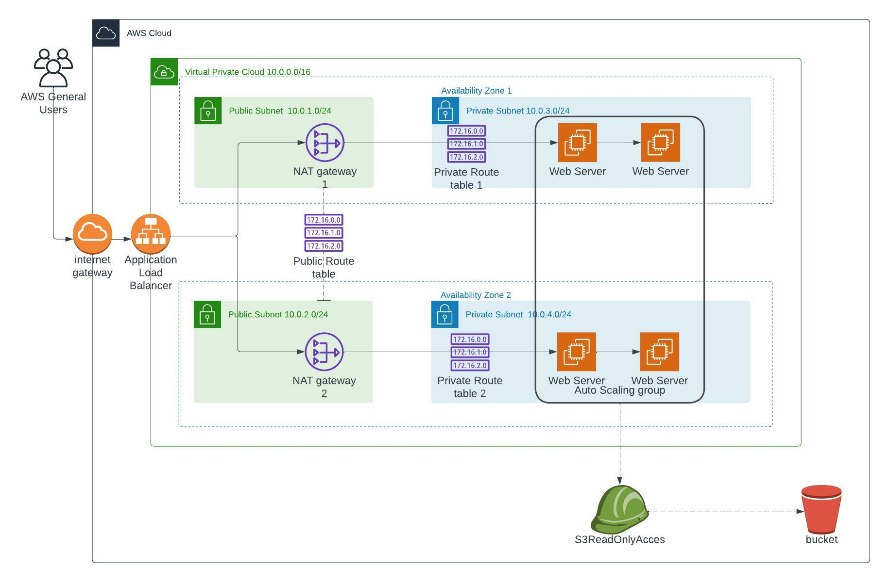

## Deploy High Availability Web App using Cloudformation

### Description
In this project, I make use of AWS's Infrastructure as Code tool to provision the necessary infrastructure components and software to deploy a dummy aplication.

Looking at the Infrastructure Diagram above the following components are used
- ##### Network Stack
    - Two Availability zones
    - Internet Gateway to enable communication between our AWS resources and the internet
    - Public and Private Subnets in each availability zone
    - NAT Gateways to enable communication between instances in private subnets and the internet
    - Routing Tables to direct traffic within the VPC

- ##### Server Stack
    - Security Groups to block/allow certain network traffic
    - Autoscaling for elasticity and high availability
    - Load Balancer to distribute traffic among servers in the Autoscaling group

### How it works?
To provision the infrastructure and deploy the app make use of the following script
- deploy.sh
This script takes in 6 arguments which i have already hardcoded for your convenience, so just run deploy.sh and the network stack {NetInfra} and server stack {SeverInfra} will be provisioned.

To teardown the infrastructure once you're done testing make use of the following script
- destroy.sh
Following the same procedure as above, I have hardcoded the arguments for your convenience.
